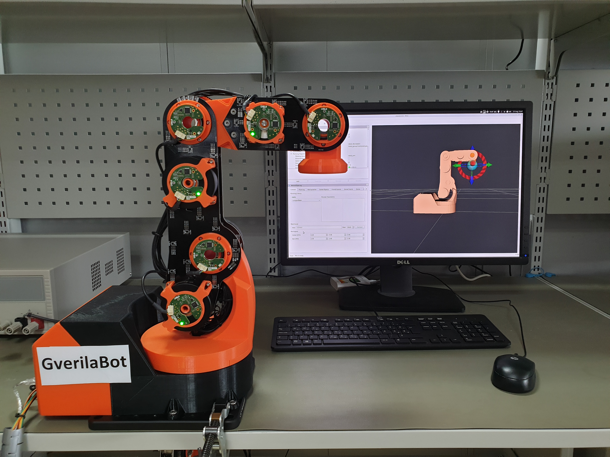
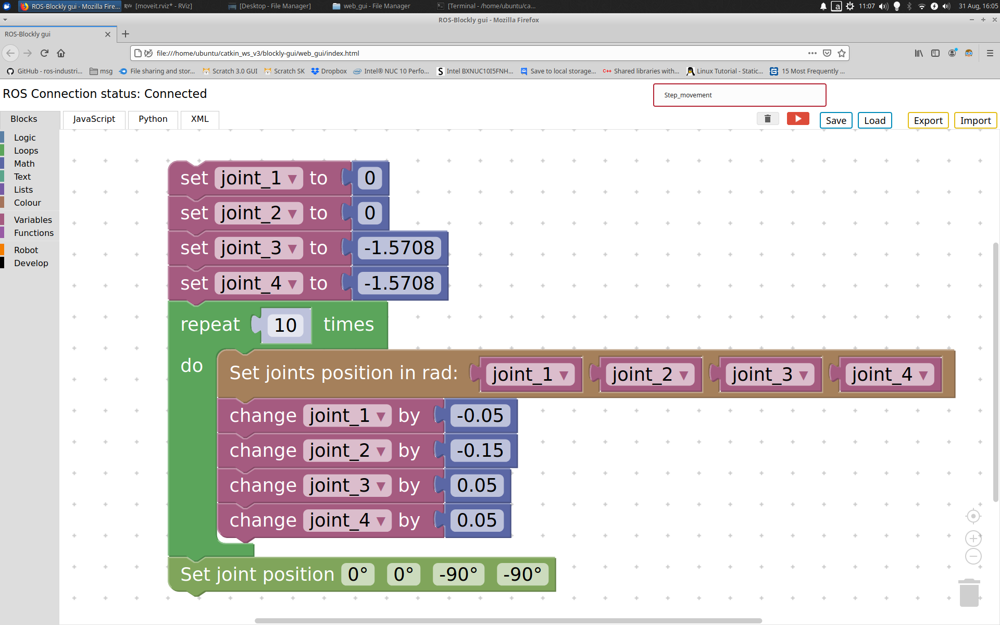

# GverilaBot ROS stack
> working prototype.
Webpage: [https://www.gverilabot.com](https://www.gverilabot.com/)



## Status: In development
Disclaimer: Project is still in development and does not represent final product.

## Getting Started - simulation mode:

Prerequisites:
* Ubuntu 18.04
* ROS Melodic  (other versions are not supported)
#### Installing

- Install ROS [Melodic Morenia](http://wiki.ros.org/melodic/Installation/Ubuntu) distribution, which is available for Ubuntu Bionic (18.04 LTS)
- Install all required debian ROS packages.
```
sudo apt-get install ros-melodic-robot-state-publisher ros-melodic-moveit ros-melodic-ros-control ros-melodic-ros-controllers ros-melodic-rosbridge-suite ros-melodic-rosbridge-server 
```
- Create a catkin workspace and clone GverilaBot packages
```
mkdir -p ~/catkin_ws/src
cd ~/catkin_ws/src
git clone https://github.com/SimonKajsner/GverilaBot_ROS.git
```
- Build the packages :
```
cd ~/catkin_ws/
catkin_make
```
- To utilize the things installed, simply source your new setup.*sh file:

```
source ~/catkin_ws/devel/setup.bash
```
-  Add environment variables permanently in your .bashrc
*If you have more than one ROS workspace installed, ~/.bashrc must only source the setup.bash for the version you are currently using.*
```
echo "source ~/catkin_ws/devel/setup.bash" >> ~/.bashrc
```

#### Launch rviz simulation:
```
roslaunch rls_robot_v3_bringup rls_robot_v3_bringup_simulation.launch 
```
### Robot Graphical User Interface
Control your robot with Block-based GUI

Create Folder and clone repository.
```
mkdir -p  ~/GverilaBot_GUI/web_gui
cd ~/GverilaBot_GUI/web_gui
git clone https://github.com/SimonKajsner/GverilaBot_ROS.git
```
Open [index.html](https://github.com/SimonKajsner/GverilaBot_GUI/blob/master/index.html) with your favourite web browser and start programming. 


