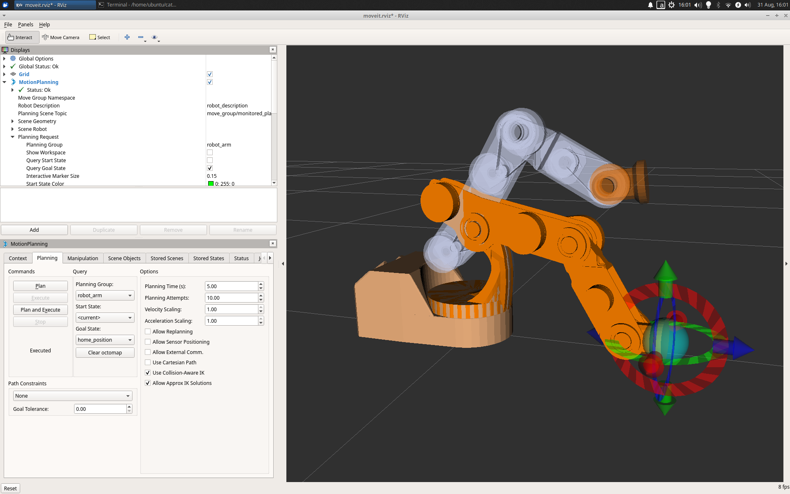

# GverilaBot ROS stack
---
> Webpage: [https://www.gverilabot.com](https://www.gverilabot.com/)
> GNU Affero General Public License v3.0 (for more information see [LICENSE](LICENSE) file)


## Status: In development
Disclaimer: Project is still in development and does not represent final product.

## Getting Started - simulation mode:

Prerequisites:
* Ubuntu 18.04 [[Desktop version](https://releases.ubuntu.com/18.04.5/), [Raspberry Pi 4](https://ubuntu.com/download/raspberry-pi)]
* ROS Melodic  (other versions are not supported)
#### Installation

1. Install ROS [Melodic](http://wiki.ros.org/melodic/Installation/Ubuntu) distribution, which is available for Ubuntu Bionic (18.04 LTS). 
*Be sure to choose Desktop-Full Installation option.*

2. Install all required debian ROS packages.
```
sudo apt-get install ros-melodic-robot-state-publisher ros-melodic-moveit ros-melodic-ros-control ros-melodic-ros-controllers ros-melodic-rosbridge-suite ros-melodic-rosbridge-server 
```

3. Create a catkin workspace and clone GverilaBot packages
```
mkdir -p ~/catkin_ws/src
cd ~/catkin_ws/src
git clone https://github.com/SimonKajsner/GverilaBot_ROS.git
```

4. Build the packages :
```
cd ~/catkin_ws/
catkin_make
```

5. To utilize the things installed, simply source your new setup.*sh file.
```
source ~/catkin_ws/devel/setup.bash
```

6. Add environment variables permanently in your .bashrc
*If you have more than one ROS workspace installed, ~/.bashrc must only source the setup.bash for the version you are currently using.*
```
echo "source ~/catkin_ws/devel/setup.bash" >> ~/.bashrc
```

#### Launch rviz simulation:
```
roslaunch rls_robot_v3_bringup rls_robot_v3_bringup_simulation.launch 
```


### Robot Graphical User Interface
---
Control your robot with [Block-based GUI](https://github.com/GverilaBot/GverilaBot_GUI)


Create Folder and clone repository.
```
mkdir -p  ~/GverilaBot_GUI/web_gui
cd ~/GverilaBot_GUI/web_gui
git clone https://github.com/GverilaBot/GverilaBot_ROS.git
```
Open [index.html](https://github.com/GverilaBot/GverilaBot_GUI/blob/master/index.html) with your favourite web browser and start programming. 


