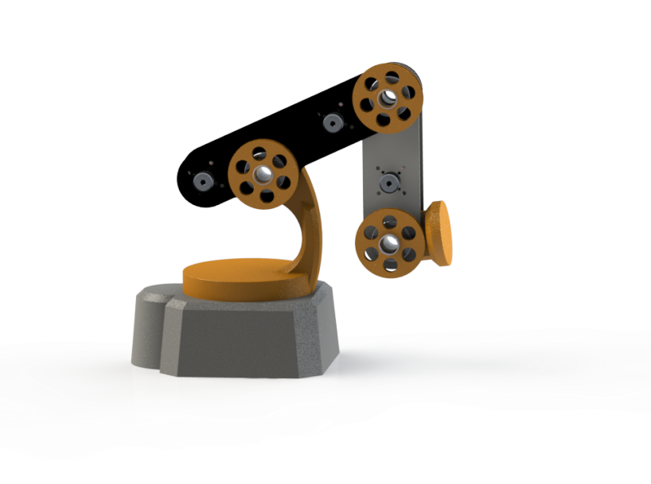

# GverilaBot ROS stack
> This is working prototype.




## Status: In development
Disclaimer: Project is still in development and does not represent final product.

## Instructions:
Requrements:
* Ubuntu 18.04
* ROS Melodic  (other versions are not supported)

Launch rviz with GverilaBot:
```
roslaunch rls_robot_v3_bringup rls_robot_v3_bringup_simulation.launch 
```

